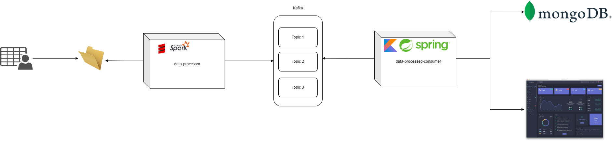
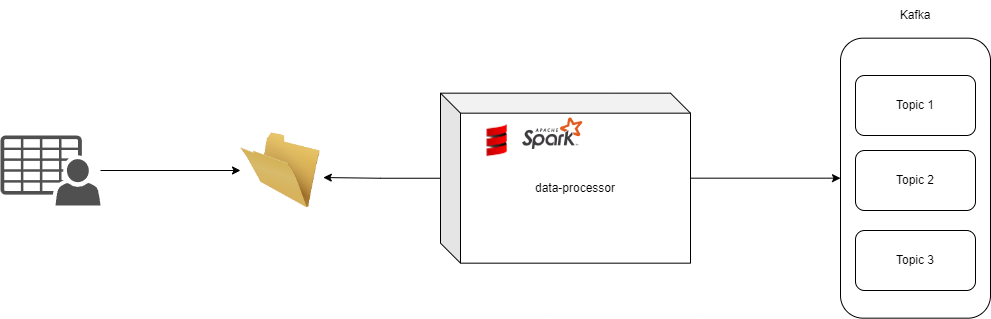

# PFSD PROJECT DATA PROCESSOR
Como parte de la solución propuesta para soluciónar la necesidad de la organización 
**Armirene** para disminuir los tiempos que demoran actualmente en calcular sus metricas,
se realizaron dos servicios los cuales se encarga de generar dicha información a partir
de una arquitectura orientada por eventos.

La arquitectura completa del proyecto es la siguiente:

La parte que aquí se soluciona es la siguiente:

## Instrucciones
1. Primero debe levantar el contenedor de [docker](docker/kafka/docker-compose.yaml)
creado para levantar una instancia de Kafka ya que este proyecto hace uso de esto.

2. Debe crear un directorio en el escritorio de su maquina ya que para que el programa
detecte que se ha ingresado un nuevo archivo para tratar, al momento de este ser
insertado, no debe estar el explorador de archivos abierto, de lo contrario el programa
dira que ya hay algo mas haciendo uso de este recurso.

3. Correr la clase **FileReaderStream**.

**Nota: Los datos que puede usar se encuentran en el directorio llamado [data](/data).**